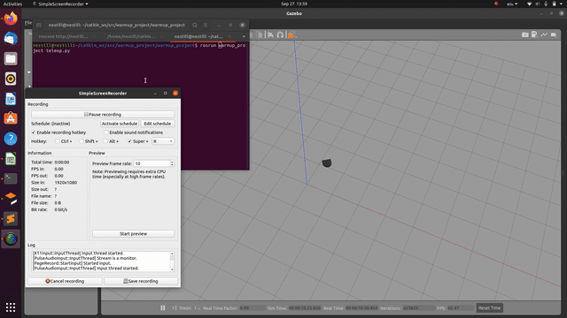
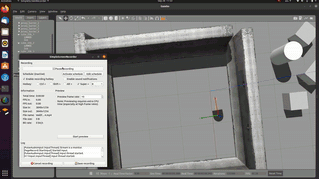
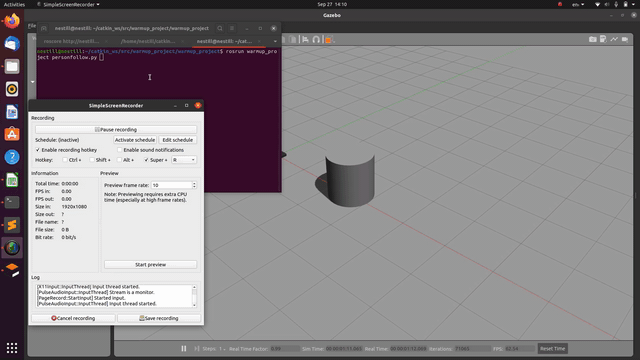
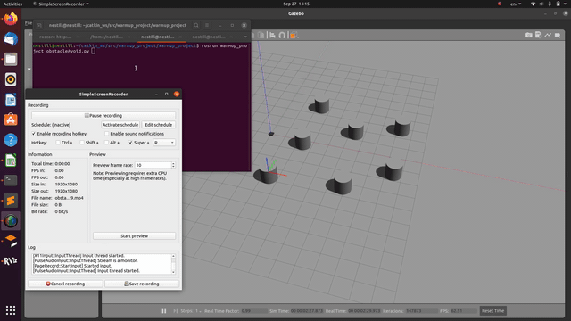
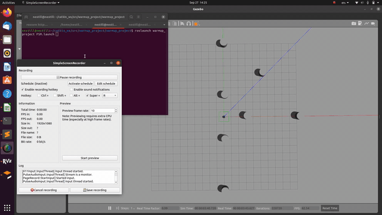

# Warmup Project
## Nathan Estill

### Teleop

The first problem is to create a node that takes in keyboard strokes and converts them into velocity commands. To do this, each keystroke is collected. If the keystroke corresponds to one of the keys indicated in the table below, the corresponding twist message is published to the velocity command. All of this is within a loop that breaks when the cancel key command is inputed.

| |  |  |
|---|---|---|
| u - linear.x=1,angular.z=1 | i - linear.x=1,angular.z=0 | o - linear.x=1,angular.z=-1|
| j - linear.x=0,angular.z=1 | k - linear.x=0,angular.z=0 | l - linear.x=0,angular.z=-1 |
| m - linear.x=-1,angular.z=1 | , - linear.x=-1,angular.z=0 | . - linear.x=-1,angular.z=-1 |

### Square

The second problem is to create a node that moves the Neato in a 1m by 1m square. I did this by using the odometry of the Neato. There are essentially two states: driving forward and turning. Before the first state starts, the location of the Neato is recorded. During the driving forward state, a message to drive forward is continuously sent to the Neato. Every tick, the distance the Neato has moved is calculated using the odometry and the previously recorded position. If the distance is greater than 1 meter, it records the current orientation and moves to the turning state. During the turning state, a message to turn is continuously sent to the Neato. Every tick, the degree the Neato has turned is calculated using the odometry and the previously recorded orientation. If the degree is greater than 90 degrees, it records the current position and moves back to the driving forward state. Thus, the steps repeat, causing the Neato to move in a square.

### Wall Follow

The next problem is to create a node that follows the wall using the LIDAR sensor. For each tick, an average of all scans from 30 degrees to 60 degrees are averaged to form the front scan, and all scans from 120 degrees to 150 degrees are averaged to form the back scan. If the front scan average is larger than the back scan, then the robot will move forward and slightly to the right. If the front scan average is less than the back scan, then the robot will move forward and slightly to the left. The respective actions will eventually make the robot follow along the wall.

### Person Follow

This problem is to follow a person that is in front of the robot. To find the person, the smallest distance from the scan is translated to Cartesian coordinates in the Neato reference frame. The X coordinate is fed into the linear velocity. This results in a faster speed if the person is farther and slower as it approaches the person. The Y coordinate is fed into the angular velocity. This results in the robot turning towards the person, lowering the Y coordinate until the person is directly ahead of the robot. Both of these combined allow the robot to turn towards the person while moving forward as well.

### Obstacle Avoidance

The penultimate problem is to create a node that will navigate through obstacles in order to reach a goal. To do this, I used the concept of a potential field. Each point in the laser scan that is within a certain range causes a vector to be applied to the robot away from it. The goal that is chosen applies a large vector towards it, even from far away. These vectors are summed up to get the vector that the Neato will follow, using the same vector to twist command as the Person Follow section. In this way, the robot will naturally stray away from obstacles and go towards the goal. The solution is not perfect, as sometimes the push away is not enough to prevent the robot from touching obstacles slightly. If I had more time, I would have played with the values to ensure that the robot neither hits obstacles nor goes the other way when given multiple obstacles.

### Finite State Machine (dubbed Seek & Destroy)

The final problem is to create a state machine that combines behaviors into a state machine. For this task, I chose the obstacle avoidance and person follow behaviors. First a goal is published from RVIZ that indicates the general location of an object. The obstacle avoidance behavior navigates around obstacles and approaches that goal (this is Seek). Once the robot gets close enough to that goal, the behavior switches to person following. In person following, the robot detects the object mentioned above and drives into it (this is Destroy). Then selecting a new goal with RVIZ changes the behavior back to obstacle avoidance and the process starts again.

To implement this, I created a FSM node that selects which velocity command should be listened to, and handles the transitions. The obstacle avoidance and person follow behaviors were modified to publish to '/cmd_vel_state' instead of '/cmd_vel', publishing instead a TwistStamped that indicates which behavior is sending that command. The FSM node forwards the commands from '/cmd_vel_state' to '/cmd_vel' if and only if that command came from the behavior that is currently active. When a point is published to '/move_base_simple/goal' through RVIZ, the active state changes to obstacle avoidance, and when the distance between the robot's odometry is within 3 meters of the goal, the active state changes to person follow.
